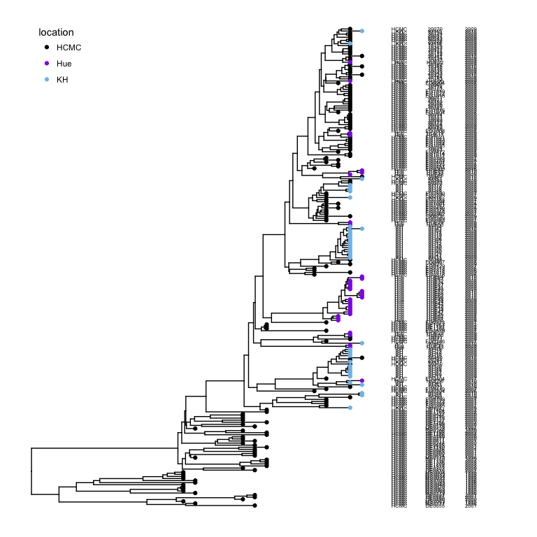
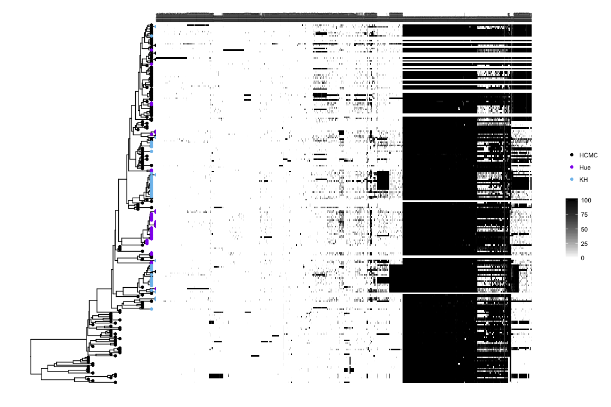
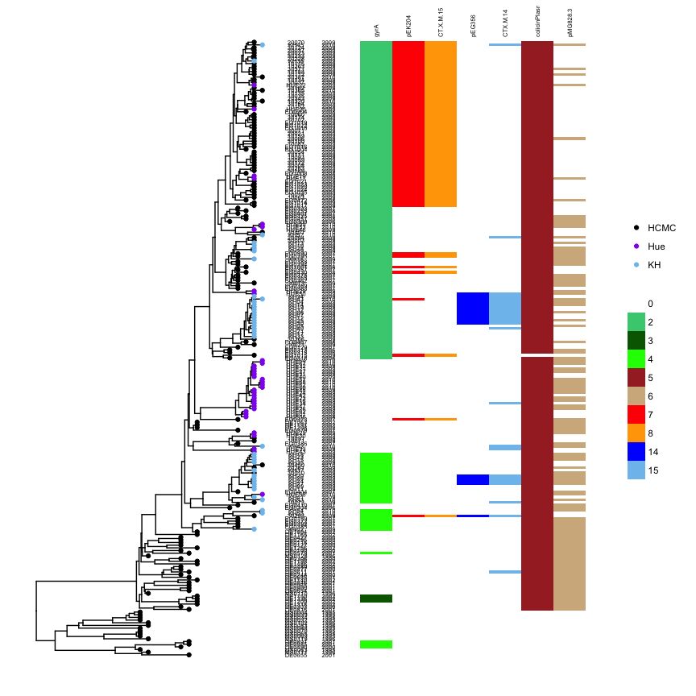
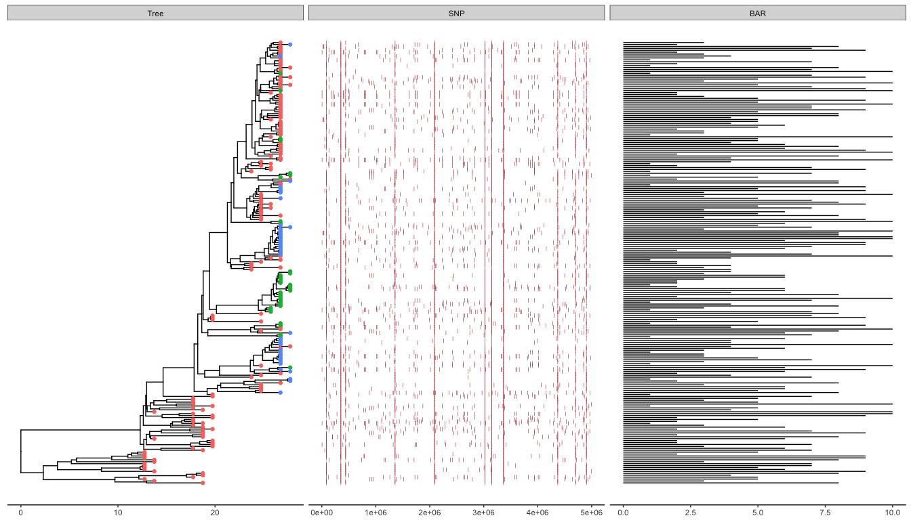

ggtree version of plotTree
==========================

[plotTree](https://github.com/katholt/plotTree) (Plotting trees with
data using R and Python) is developed by Kat Holt - @DrKatHolt -
<http://holtlab.net>.

This repository used example data of the `plotTree` to re-create figures
generated by `plotTree.R`.

Basic strain info
-----------------

    source("01_basic_strain_info.R")

Pan genome heatmap
------------------

    source("02_pan_genome_heatmap.R")

Curated genes, coloured
-----------------------

    source("03_curated_genes.R")

Plot tree with data
-------------------

    # in case colnames start with numbers or contain dashes, which R does not like as column headers
    snps<-read.csv("plotTree/tree_example_april2015/alleles.csv",header=F,row.names=1, stringsAsFactor=F) 
    snps_strainCols <- snps[1,] # column names = strain names
    snps<-snps[-1,] # drop strain names
    colnames(snps) <- snps_strainCols

    gapChar <- "?"
    snp <- t(snps)
    lsnp <- apply(snp, 1, function(x) x != snp[1,] & x != gapChar & snp[1,] != gapChar)
    lsnp <- as.data.frame(lsnp)
    lsnp$pos <- as.numeric(rownames(lsnp))
    lsnp <- tidyr::gather(lsnp, name, value, -pos)

    ## dataset 1
    snp_data <- lsnp[lsnp$value, c("name", "pos")]
    head(snp_data)

    ##              name     pos
    ## 394 10014_HCMC_NA 2090164
    ## 401 10014_HCMC_NA 1357659
    ## 409 10014_HCMC_NA 3145957
    ## 419 10014_HCMC_NA 4902236
    ## 484 10014_HCMC_NA 1339574
    ## 498 10014_HCMC_NA  354844

    ## dataset 2
    bar_data <- read.csv("plotTree/tree_example_april2015/bar.csv")
    head(bar_data)

    ##                  id dummy_bar_value
    ## 1  CS14_Brazil_2001               5
    ## 2   CS2_Brazil_1997              10
    ## 3  CS20_Brazil_2002               2
    ## 4   CS6_Brazil_2000               7
    ## 5   CS7_Brazil_2000               8
    ## 6 373_Cameroun_1973              10

    library(ggtree)
	
	info <- read.csv("info.csv")
	tree <- read.tree("tree.nwk")
    
	p <- ggtree(tree) %<+% info + geom_tippoint(aes(color=location))

    alnplot(p, panel="SNP", data=snp_data, geom=geom_point, mapping=aes(x=pos), pch='|', color="firebrick") %>%
        alnplot("BAR", bar_data, geom_segment, aes(x=0, xend=dummy_bar_value, y=y, yend=y)) + theme_tree2()

